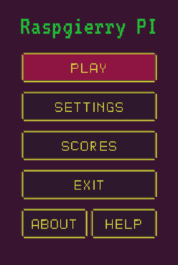
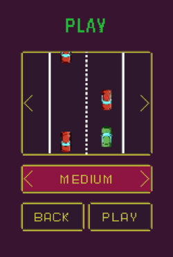
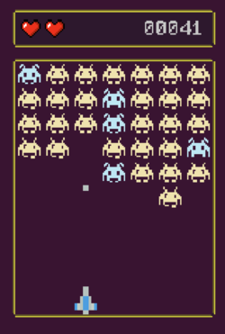
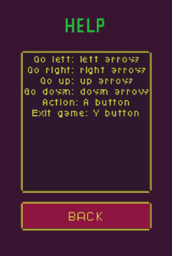
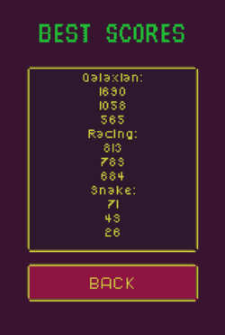

# Raspgierry Pi

Equivalent of the classic Brick Game recreated in Python for Raspberry Pi 3

## Demo

First view in the game is main menu where you can navigate through various things you can do:

  

One of them is a game choice which pops up after pressing "play" button:

  

After choosing the game you will be able to play:

  

If you don't know how to play you can go to the help view:

  

Or if you already achieved something you can find your result in best scores:

  

## Getting Started

These instructions will get you a copy of the project up and running on your local machine for development and testing purposes. See deployment for notes on how to deploy the project on a live system.

### Prerequisites

#### Hardware

* Raspberry Pi 3B+
* Touchscreen Waveshare A - LCD TFT 3.5"
* SNES USB gamepad
* micro SD card

#### Software

* Raspbian 4.14
* Python 3.53
* PyGame 1.9.3
* *(OPTIONAL)* VNC Viewer

### Installing

#### Local machine
1. Install Python  3.53 on any development-friendly device
2. Clone this repository to your local drive
3. Open and run main.py from the root/src directory

#### Raspberry Pi
1. Plug in the touchscreen and controllers
2. Install Raspbian on the micro SD card like [HERE](https://www.raspberrypi.org/documentation/installation/installing-images/)
2. Install drivers for the touchscreen as described [HERE](https://www.waveshare.com/wiki/3.5inch_RPi_LCD_(A)#Getting_Started)
3. Install Python 3.53
4. Clone repository to the drive

## Deployment

1. Turn Raspberry on
2. *(OPTIONAL)* plug in HDMI cable to a monitor or use VNC(e.g. VNC Viewer) to see the desktop on a bigger screen
3. Fetch the newest code from the repository
4. Run main.py with Python and enjoy!

## Authors

*  [Jakub Gros](https://github.com/jakubgros)
*  [Sebastian Kucharzyk](https://github.com/kucharzyk-sebastian/NES_emulator)
*  [Mateusz Olejarz](https://github.com/MatOlejarz)

## License

This project is licensed under the MIT License - see the [LICENSE.md](LICENSE.md) file for details

## Acknowledgments

* Code style guide used: PEP 8 (https://www.python.org/dev/peps/pep-0008/) 
